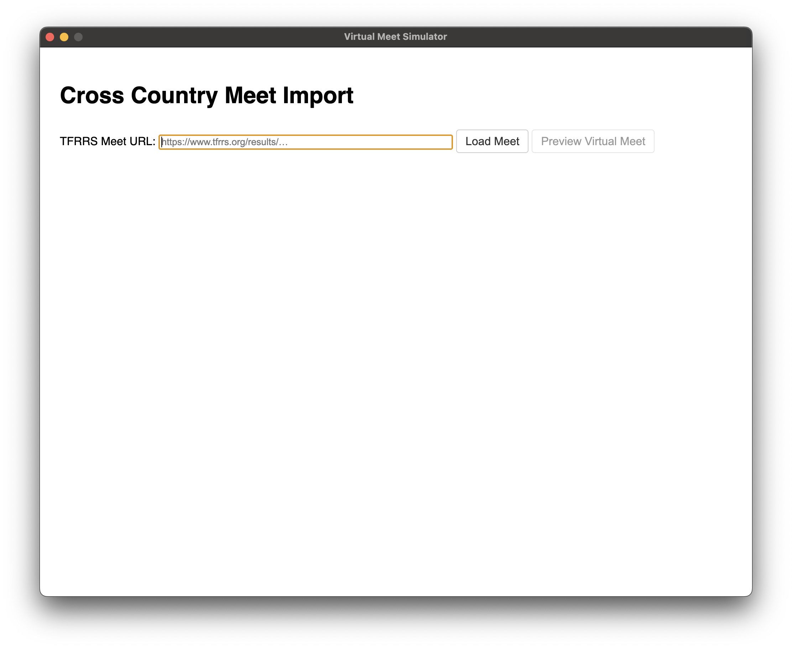
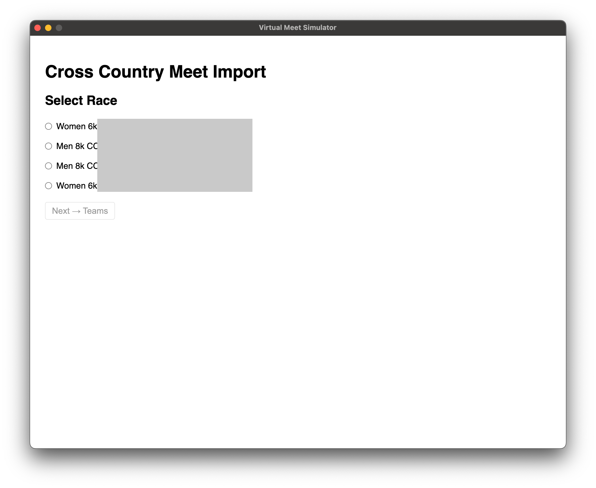
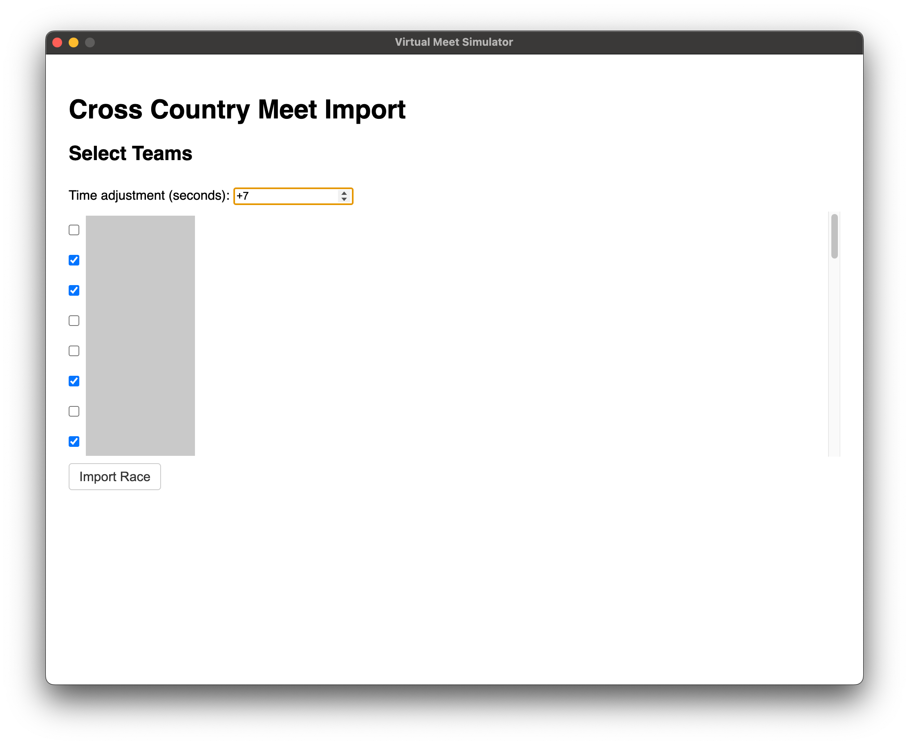
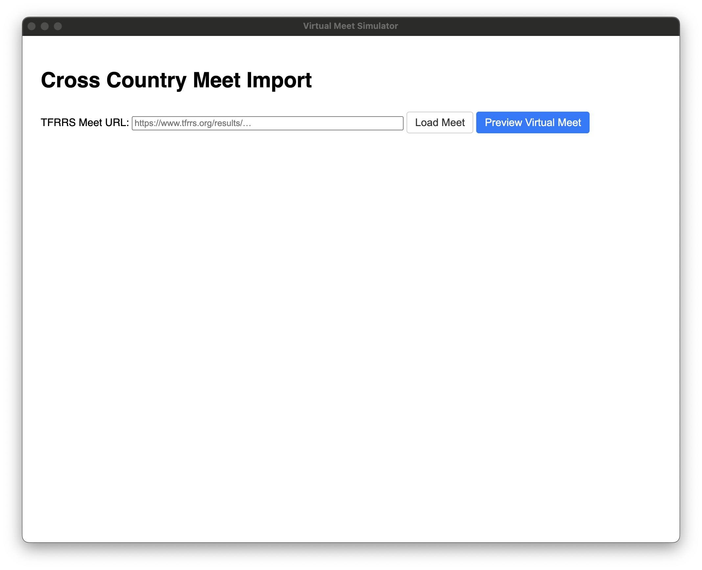
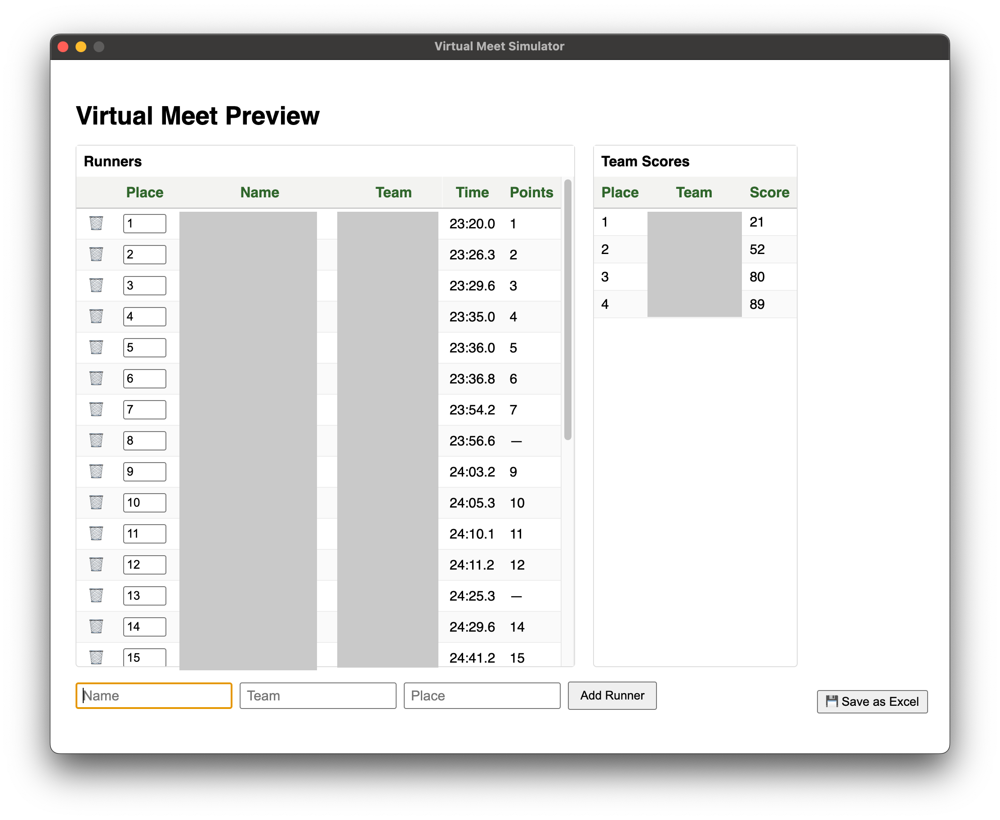

# College XC Virtual Meet

This project is now a browser-based web app for previewing and exporting cross country meet results from TFRRS. It’s helpful for coaches to simulate upcoming meets based on previous performances without installing a desktop client.

---

## Getting Started

1. Install dependencies: `npm install`
2. Start the dev server (auto-restarts on changes): `npm run dev`
3. Open your browser to [http://localhost:3000](http://localhost:3000)

To run the server without watch mode (or when deploying): `npm start`

---

## Building for Deployment

`npm run build` creates a `dist/` folder containing the Express server (`server/`), scraper helper (`scraper/`), and the static frontend (`renderer/`). Deploy by copying `dist/` to your host and running `node dist/server/index.js`.

---

## What It Does

Cross country courses and races can vary significantly in speed. This tool helps preview upcoming meets by combining multiple race performances and adjusting for course speed differences.

You give the app one or more TFRRS links, select which teams to include, apply optional time adjustments (for example, +7 seconds), and it builds a virtual meet for you.

From there, you can:

- Add new runners
- Remove runners
- Change a runner’s placement
- Export the results to Excel

Note: Runners added manually won’t count towards team scores until the team has at least five runners.

---

## Screenshots & Walkthrough

Below are the main steps, with screenshots showing each part. 

### 1. Main Screen

Shows where to paste the TFRRS meet link.

---

### 2. Race Selection

Choose which race within the meet to import.

---

### 3. Team Selection

Pick the teams you want to include in the virtual meet. You can also set a global time adjustment (+7 means adding 7 seconds to every runner).

---

### 4. Ready to Preview

Once at least one race is loaded, the 'Preview Virtual Meet' button becomes active.

---

### 5. Virtual Meet Preview

View individual results and team scores. You can edit the race—adding or removing runners, changing their place—and everything updates in real time.

You can also export the results to Excel at any point.

---

## Additional Notes

- The screenshots show redacted names and team labels for privacy.
- Exported Excel files include individual results and team scores side by side.
- On Windows, the text fields can occasionally be buggy. If this happens, try clicking outside the application and then back into it before typing.
